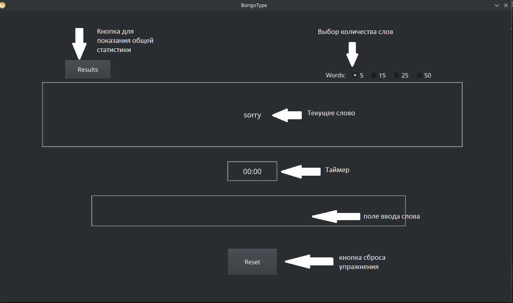

# BongoType
App for training speed of touch typing
## Автор ##

Султанов Эмиль
***

## Идея и Функции ##

 

BongoType - это приложение для тренировки слепой печать и её скорости.
Приложение предоставляет выбор колличества слов, функцию показа общей статистики, подбор случайных слов.
***

## Установка ##
```bash
    git clone https://github.com/whoiam143/BongoType.git
    cd BongoType
    python3 Main.py

```

## Использование ##
  * Новая тренировка начинается тогда, когда вы введёте любой символ на клавиатуре
    
   
  

## Реализация ##

### Основные классы ###
* MainWin - класс для создания всего окна, и работы всех функций
* Text - класс для добавления случайного текста

### Основные Функции ###
    check - функия для проверки текста
    get_some_words - функция для получения случайного текста 
    update_time - функция для обновления времени и корректного его отображения

***

## Технологии ##
 
* Приложение написано на языке Python 

* Графический интефейс проекта сделан при помощи библиотеки PyQt5

* Разработка дизайна интерфейса выполнена в приложение QtDesigner

* Логотип нарисован в Gimp
